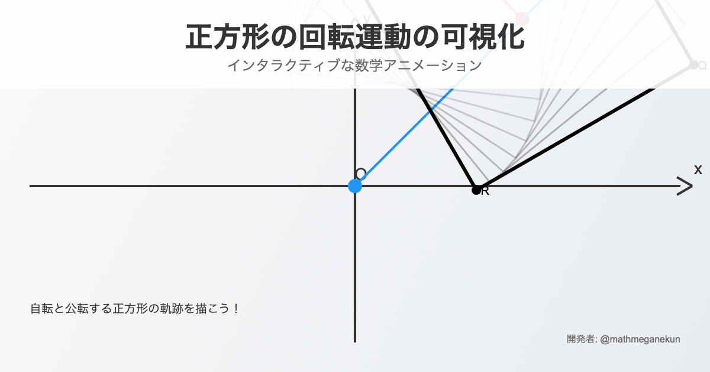

# 🔄 Square Rotation Visualization

  

正方形の回転運動を可視化するWebアプリケーションです。
アプリはこちら👉 [リンク](https://ou-sakumon.github.io/Square_Rotation_Visualization/square_rotation_visualization.html)

> **📝 Note**
> 
> **👨‍💻 開発者**: **Tanaka Mikihisa**
> - **X**: [@mathmeganekun](https://x.com/mathmeganekun?s=11)
> - **GitHub**: [@tanakamikihisa](https://github.com/TanakaMikihisa)

## 📄 ライセンス

教育目的で作成されています。